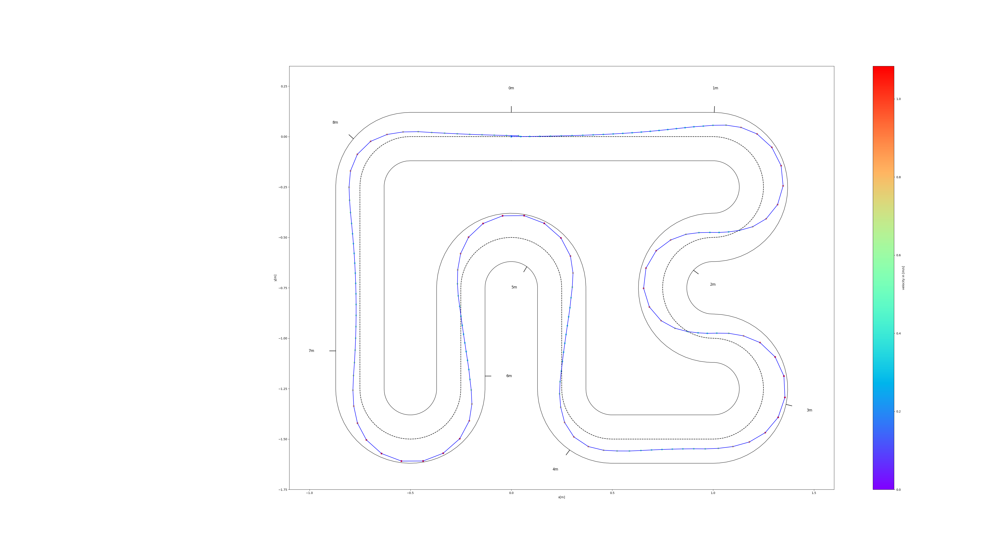
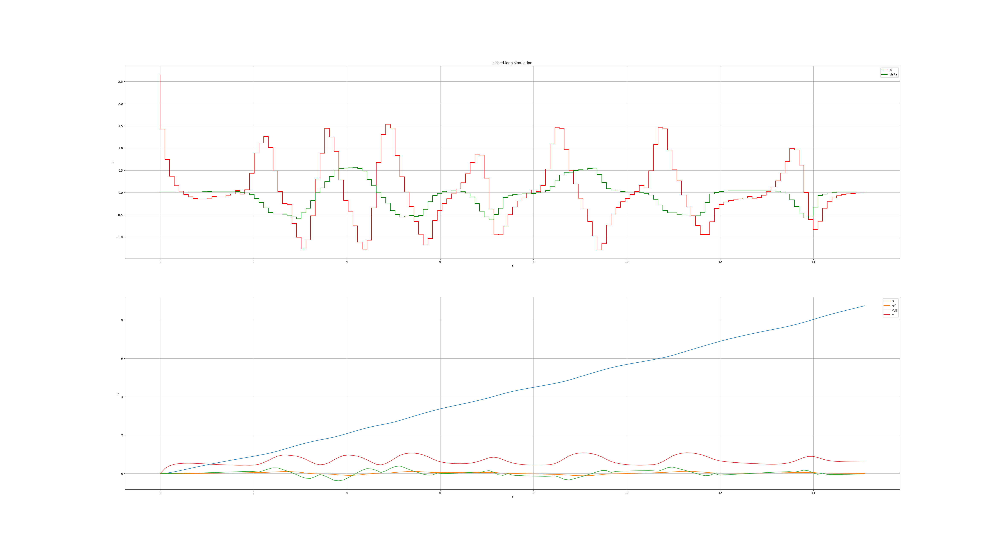

# Race Car MPC with Spline-Based Trajectory Tracking

This project implements a Model Predictive Control (MPC) system for autonomous race car trajectory tracking using cubic splines and a bicycle model. It is based on the race-car example from the [acados](https://github.com/acados/acados) project, with enhancements for spline-based trajectory generation and improved visualization.

## Overview

The system combines:
- **Bicycle Model**: Simplified vehicle dynamics for racing applications
- **Cubic Spline Interpolation**: Smooth trajectory generation from track waypoints
- **MPC Controller**: Real-time optimization for trajectory following using acados
- **Clothoid Splines**: Advanced spline fitting for racing track representation

## Visual Results

### Race Car Trajectory

*Vehicle trajectory following the racing track with MPC control*

### Progression Analysis

*Control Signals and The Progression of States through the lap*

## Project Structure

```
├── MPC_race_cars_simplified/    # Main MPC implementation
│   ├── bicycle_model.py         # Vehicle dynamics model
│   ├── acados_settings_dev.py   # MPC solver configuration
│   ├── plotFcn.py              # Visualization functions
│   ├── time2spatial.py         # Coordinate transformations
│   └── tracks/                 # Track data files
├── Utils/                      # Utility modules
│   ├── symbolic_cubic_spline.py    # Symbolic spline implementation
│   ├── clothoid_spline.py          # Clothoid spline fitting
│   └── 2d_symbolic_cubic_spline.py # 2D spline utilities
├── examples/                   # Usage examples
│   ├── race_cars_simplified.py     # Main racing simulation
│   └── test_clothoid_spline.py     # Spline testing
└── c_generated_code/           # Auto-generated acados C code
```

## Features

### Vehicle Model
- **Bicycle Model**: Simplified 4-state model (progress, lateral deviation, heading, velocity)
- **Constraints**: Lateral acceleration limits, steering and acceleration bounds
- **Spatial Parameterization**: Track-following using curvilinear coordinates

### Trajectory Generation
- **Cubic Splines**: Symbolic Cubic-Splines for piece-wise references
- **Clothoid Splines**: Advanced spline fitting for racing applications, in reality this is an implementation of a curve with cubic-spline curvature, so it isn't technically a 'clothoid'
- **Real-time Adaptation**: Dynamic spline updates based on current position

### MPC Controller
- **acados Integration**: High-performance optimization solver
- **Receding Horizon**: Configurable prediction horizon and discretization
- **Constraint Handling**: Hard constraints on vehicle dynamics and track boundaries

## Installation

### Prerequisites
- Python 3.7+
- acados (follow [official installation guide](https://docs.acados.org/))

### Dependencies
```bash
pip install -r requirements.txt
```

Required packages:
- numpy >= 1.21.0
- scipy >= 1.7.0
- matplotlib >= 3.5.0
- acados_template >= 0.2.0
- casadi >= 3.5.0

## Usage

### Basic Racing Simulation
```python
from MPC_race_cars_simplified.acados_settings_dev import acados_settings
from Utils.symbolic_cubic_spline import SymbolicCubicSpline

# Setup MPC
Tf = 5.0  # prediction horizon
N = 50    # discretization steps
track = "LMS_Track.txt"
constraint, model, acados_solver = acados_settings(Tf, N, track, num_points=50)

# Create spline for trajectory
clothoid_spline = SymbolicCubicSpline("tracks/LMS_Track.txt")

# Run simulation
# (see examples/race_cars_simplified.py for complete example)
```

### Running the Example
```bash
python3 examples/race_cars_simplified.py
```

This will:
1. Load the racing track data
2. Initialize the MPC controller with bicycle model
3. Run a complete lap simulation
4. Display results including:
   - Vehicle trajectory
   - Control inputs (acceleration, steering)
   - Lateral acceleration constraints
   - Track projection

## Configuration

### MPC Parameters
- **Prediction Horizon**: Adjustable via `Tf` parameter
- **Discretization**: Control via `N` parameter
- **Cost Weights**: Modify Q, R matrices in `acados_settings_dev.py`
- **Constraints**: Lateral acceleration limits in `bicycle_model.py`

### Track Data
- Track files are stored in `MPC_race_cars_simplified/tracks/`
- Format: Text files with waypoint coordinates
- Custom tracks can be added following the existing format

## Troubleshooting

### Common Issues
1. **acados Compilation Errors**: Ensure acados is properly installed and compiled
2. **QP Solver Issues**: Try switching between QPOASES and HPIPM solvers
3. **Version Compatibility**: Check acados and acados_template versions match

### Performance Tuning
- Adjust prediction horizon `Tf` for computation vs. performance trade-off
- Modify cost weights for different racing styles
- Tune constraint limits based on vehicle capabilities

## License

This project uses the 2-Clause BSD License, as indicated in the source files. 
